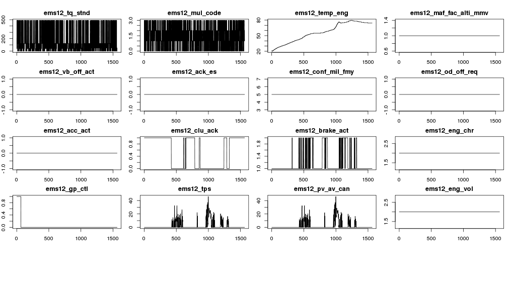

---
output:
html_document:
toc: yes
---
---
title: "Hongple"
author: "Joel Lee"
since: "2015. 5. 8."
output: html_document
runtime: shiny
---


#### 가설

```
초당 센서 값들의 각 조합에 대한 발생빈도를 계산, 발생 확률이 극히 낮거나 처음 발견되는 센서 값의 조합 발생시 이상패턴으로 정의, 탐지 가능하다.
```

#### 대상 데이터 

- 단말사양 : AVN4 RC
- 국가 : 국내
- 차종 : UM
- 종류 : 주기적 운행 로그 (월 1회, vin별 1 trip, 1시간 이내 sample rate : 1 sec.)
- 테이블 : hkmc_tms.drv_rg_log_ps_avn4_rc
- 센서 : 227개
- 기간 : 6개월
- 클러스터 : 분석계 대화형
- 데이터베이스 : vcrm_6442267

#### 분석 프로세스

```
연속형센서 범주화 및 기초 통계 -> 이상 패턴 탐색 -> 고장 조기 감지
```

##### 초기화 및 대화형 임팔라 접속  
```{r load, echo=FALSE, results='hide'}

# install.packages("Hmisc")
# install.packages("RODBC")
# install.packages("sqldf")
# install.packages('ggplot2')
# install.packages("psych")
# install.packages("rmarkdown")
# install.packages("cluster")
# install.packages("fpc")

library("Hmisc")
library("rmarkdown")
library("RODBC")
library("sqldf")
library(ggplot2)
library("psych")
library(cluster)
library(fpc)
```

```{r echo=FALSE}
setwd("~/workspace/hongple")
rm(list = ls())  # clear objects  
conn = odbcConnect( "Impala2" )
sqlQuery( conn, "invalidate metadata" )
```

##### 1차 데이터 가공
- drv_rg_log_ps_avn4_rc_seq : 정기 운행로그에 주행별 시퀀스 추가(61,972,965건)

차종  | 레코드수(초당)
---- | ----
DM  | 19110538
UM  | 36321553
KH  | 106191
AG  | 6432762
TL  | 1921

차종 | 주행 횟수 | 최초 주행시간 | 최종 주행시간 | 평균 주행(초수)
------------ | ---------- | ------------ | ------------- | ---------
DM  | 12410 | 20141102020436  | 20150405185031  | 1534
UM  | 24863 | 20141001055302  | 20150405175643  | 1446
KH  | 78  | 20150111002956  | 20150405095542  | 1361
AG  | 4655  | 20141111093204  | 20150405104945  | 1379
TL  | 1 | 20150404181150  | 20150404181150  | 1921

차종 |	차량대수
--- | ---
UM	| 4904
AG	| 703
DM	| 5578
TL	| 1
KH	| 49

샘플 데이터 가져오기
```{r qplot, fig.height=3, fig.width=6, cache=TRUE}
df_sample = data.frame(sqlQuery( conn, "select * from vcrm_6442267.drv_rg_log_ps_avn4_rc_seq
                                 where vin = 'KNAPK81ABFA010727' and ignitiontime = '20141211074429'
                                 order by seq_num"))

#plot(df$seq_num, df$ems16_tqi_min, type="l", ylab="ems16_tqi_min", xlab="time(sec)")
qplot(seq_num, ems16_tqi_min, data = df_sample) + geom_smooth()
```

연속형 멀티센서 시계열 탐색
```{r plot}
# timeseries multiple plot
# par(pch=22, col="red") # plotting symbol and color 
graphics.off()    # close graphics windows
# 20 of 227 plots on one page
par(mfrow=c(5, 4), mar = c(2, 2, 2, 1), oma = c(0, 0, 1, 0)) 
signals = names(df_sample)

for(i in 7:25){ 
    signal_ts <- df_sample[,i]
    plot.ts(signal_ts, type="l", main=signals[i]) 
    }
```


##### 2차 데이터 가공  
- drv_rg_log_ps_avn4_rc_factor10 : 연속형 센서 범주화 (10개씩 쪼개기)
- 전체 센서들에 대한 조합의 빈도수가 높지 않아 불필요한 센서 제거해야함.
- engfrzfrm12 센서그룹 제외(NULL 만 들어있음)
- 주요 센서그룹 Null 비율

센서그룹 | 전체 NULL(건수) | 전체 NULL(비율) | UM NULL(건수) | UM NULL(비율)
---- | ---- | ---- | ---- | ----
engfrzfrm12 | 61,972,965 | `r 61972965/61972965*100`% | 36,321,553 | 100%
ems19 | 25,649,491 | `r 25649491/61972965*100`% | 0 | 0%
fatc11 | 25,650,803 | `r 25650803/61972965*100`% | 1,312 | `r 1312/36321553*100`%
bat11 | 25,650,996 | `r 25650996/61972965*100`% | 1,505 | `r 1505/36321553*100`%
cgw1 |  26,613,289 | `r 26613289/61972965*100`%  | 963,797 | `r 963797/36321553*100`%


Checksum 센서 제외  
- ems19_cf_ems_checksumems9
- ems16_checksum
- fatc11_cf_fatc_chksum
- tcu11_cf_tcu_chksum1
- sas11_checksum
- tcu12_cf_tcu_chksum
- tcu13_cf_tcu_chksum3 


##### 3차 데이터 가공
UM(Disel) 차종의 센서그룹별 센서조합의 통계를 구해서 센서별 특징을 파악한다.  

```{r showtable, results="asis", cache=TRUE, echo=FALSE}
library(xtable)

print_desc <- function(df){
    xt <- xtable(describe(df))
    print(xt, type="html")
}

df_um_ems11 = data.frame(sqlQuery( conn, "select * from vcrm_6442267.drv_rg_log_ps_avn4_rc_factor10_um_ems11"))
print_desc(df_um_ems11)

ggplot(data=df_um_ems11, aes(x=id, y=cnt)) + geom_bar(colour="black", stat="identity")
#ddply(df_um_ems11, .(ems11_swi_igk), transform, avg = mean(cnt))
#ggplot(data = df_um_ems11) + geom_density(aes(x=cnt), fill = "grey50") 
#+ scale_y_continuous(limits = c(0.000001))
#summary(df_um_ems11$cnt)
#describe(df_um_ems11$cnt)

df_um_ems16 = data.frame(sqlQuery( conn, "select * from vcrm_6442267.drv_rg_log_ps_avn4_rc_factor10_um_ems16"))
print_desc(df_um_ems16)
           
df_um_ems_h12 = data.frame(sqlQuery( conn, "select * from vcrm_6442267.drv_rg_log_ps_avn4_rc_factor10_um_ems_h12"))
print_desc(df_um_ems_h12)

df_um_tcu11 = data.frame(sqlQuery( conn, "select * from vcrm_6442267.drv_rg_log_ps_avn4_rc_factor10_um_tcu11"))
print_desc(df_um_tcu11)

df_um_tcu12 = data.frame(sqlQuery( conn, "select * from vcrm_6442267.drv_rg_log_ps_avn4_rc_factor10_um_tcu12"))
print_desc(df_um_tcu12)

df_um_tcu13 = data.frame(sqlQuery( conn, "select * from vcrm_6442267.drv_rg_log_ps_avn4_rc_factor10_um_tcu13"))
print_desc(df_um_tcu13)

df_um_fatc11 = data.frame(sqlQuery( conn, "select * from vcrm_6442267.drv_rg_log_ps_avn4_rc_factor10_um_fatc11"))
print_desc(df_um_fatc11)

df_um_bat11 = data.frame(sqlQuery( conn, "select * from vcrm_6442267.drv_rg_log_ps_avn4_rc_factor10_um_bat11"))
print_desc(df_um_bat11)

df_um_cgw1 = data.frame(sqlQuery( conn, "select * from vcrm_6442267.drv_rg_log_ps_avn4_rc_factor10_um_cgw1"))
print_desc(df_um_cgw1)

df_um_esp12 = data.frame(sqlQuery( conn, "select * from vcrm_6442267.drv_rg_log_ps_avn4_rc_factor10_um_esp12"))
print_desc(df_um_esp12)

df_um_sas11 = data.frame(sqlQuery( conn, "select * from vcrm_6442267.drv_rg_log_ps_avn4_rc_factor10_um_sas11"))
print_desc(df_um_sas11)

df_um_ems15 = data.frame(sqlQuery( conn, "select * from vcrm_6442267.drv_rg_log_ps_avn4_rc_factor10_um_ems15"))
print_desc(df_um_ems15)

df_um_ems14 = data.frame(sqlQuery( conn, "select * from vcrm_6442267.drv_rg_log_ps_avn4_rc_factor10_um_ems14"))
print_desc(df_um_ems14)

df_um_tcu13 = data.frame(sqlQuery( conn, "select * from vcrm_6442267.drv_rg_log_ps_avn4_rc_factor10_um_tcu13"))
print_desc(df_um_tcu13)

df_um_ems12 = data.frame(sqlQuery( conn, "select * from vcrm_6442267.drv_rg_log_ps_avn4_rc_factor10_um_ems12"))
print_desc(df_um_ems12)

```

**표준편차 1 이상인 센서들** 
- ems16_tqi
- ems16_tqi_target
- ems16_eng_stat
- ems16_tqi_max
- fatc11_cr_fatc_tqacnout
- fatc11_cf_fatc_msgcnt
- ems_h12_r_tqacnapvc
- ems_h12_tqi_b
- ems_h12_sld_vs
- ems_h12_cf_ems_isgstat
- ems_h12_cf_ems_descurgr
- bat11_bat_snsr_i
- bat11_bat_soc
- bat11_bat_snsr_v
- bat11_bat_soh
- bat11_bat_sof
- cgw1_cf_gway_ignsw
- cgw1_cf_gway_wiperintt
- tcu11_g_sel_disp
- tcu11_tqi_tcu
- tcu11_temp_at
- esp12_lat_accel
- esp12_long_accel
- tcu12_etl_tcu
- tcu12_cur_gr
- tcu12_cf_tcu_alive
- tcu12_vs_tcu
- tcu12_vs_tcu_decimal    
- ems11_tqi_acor
- ems11_n
- ems11_tqi
- ems11_vs
- ems15_intairtemp
- ems14_amp_can
- ems14_vb
- tcu13_slope_tcu
- tcu13_cf_tcu_targr
- tcu13_cf_tcu_shfpatt
- tcu13_cr_tcu_isgtgtrpm
- ems12_can_vers
- ems12_conf_tcu
- ems12_obd_frf_ack
- ems12_tq_stnd
- ems12_mul_code
- ems12_temp_eng
- ems12_tps
- ems12_pv_av_can


##### 4차 데이터 가공  

센서그룹의 센서조합들중 잘 나타나지 않는 조합(cnt=1)의 VIN을 구하고
해당 VIN의 RO내역을 매핑해서 특징을 살핀다.  

RO 마스터 테이블  
- hkmc_gbi.dm1_qm_02_qltyclm_f_v : 클레임마스터, 1억건 (사용)  
- text_anal.ro_mstr_new : 클레임마스터 + 특이사항(clm_prtl_sbc 컬럼), 4천만건 (미사용)


- UPECU : ECU 업그레이드(특정부품과 1:1매칭이 안될 경우의 부품번호 표기방식, 현재는 사용되고 있지 않음)

```{r results="asis", echo=FALSE}
# conn = odbcConnect( "Impala2" )
# sqlQuery( conn, "invalidate metadata" )
# library(xtable)

print_summary <- function(df){
    df$ro_y <- sapply(df$ro_y, as.factor)
    df$ceq_rgst_dt <- sapply(df$ceq_rgst_dt, as.factor)

    xt <- xtable(summary(df))
    print(xt, type="html")
}
```

**EMS11 파워트레인 계열**  
```{r results="asis"}
## EMS11 파워트레인 계열
ems11_vin_ro = data.frame(sqlQuery( conn, "select * from vcrm_6442267.factor10_um_ems11_vin_ro"))
print_summary(ems11_vin_ro)
```

**EMS16 파워트레인 계열**  
```{r results="asis"}
ems16_vin_ro = data.frame(sqlQuery( conn, "select * from vcrm_6442267.factor10_um_ems16_vin_ro"))
print_summary(ems16_vin_ro)
```


**EMS_H12 파워트레인 계열**  
```{r results="asis"}
## EMS_H12 파워트레인 계열
ems_h12_vin_ro = data.frame(sqlQuery( conn, "select * from vcrm_6442267.factor10_um_ems_h12_vin_ro"))
print_summary(ems_h12_vin_ro)
```

**BAT11 파워트레인 배터리 계열**  
```{r results="asis"}
## BAT11 파워트레인 배터리 계열
bat11_vin_ro = data.frame(sqlQuery( conn, "select * from vcrm_6442267.factor10_um_bat11_vin_ro"))
print_summary(bat11_vin_ro)
```
  
**FATC11 칵핏 계열**  
```{r results="asis"}
## FATC11 칵핏 계열
fatc11_vin_ro = data.frame(sqlQuery( conn, "select * from vcrm_6442267.factor10_um_fatc11_vin_ro"))
print_summary(fatc11_vin_ro)
```

**CGW1 시스템 계열**  
```{r results="asis"}
## CGW1 시스템 계열
cgw1_vin_ro = data.frame(sqlQuery( conn, "select * from vcrm_6442267.factor10_um_cgw1_vin_ro"))
print_summary(cgw1_vin_ro)
```

**ESP12 샤시안전제어 계열**  
```{r results="asis"}
## ESP12 샤시안전제어 계열
esp12_vin_ro = data.frame(sqlQuery( conn, "select * from vcrm_6442267.factor10_um_esp12_vin_ro"))
print_summary(esp12_vin_ro)
```

**TCU11 자동변속기 계열**  
```{r results="asis"}
## TCU11 자동변속기 계열
tcu11_vin_ro = data.frame(sqlQuery( conn, "select * from vcrm_6442267.factor10_um_tcu11_vin_ro"))
print_summary(tcu11_vin_ro)
```

**TCU12 자동변속기 계열**  
```{r results="asis"}
## TCU12 자동변속기 계열
tcu12_vin_ro = data.frame(sqlQuery( conn, "select * from vcrm_6442267.factor10_um_tcu12_vin_ro"))
print_summary(tcu12_vin_ro)
```

**TCU13 자동변속기 계열**  
```{r results="asis"}
## TCU13 자동변속기 계열
tcu13_vin_ro = data.frame(sqlQuery( conn, "select * from vcrm_6442267.factor10_um_tcu13_vin_ro"))
print_summary(tcu13_vin_ro)
```

**EMS12 자동변속기 계열**  
```{r results="asis"}
## EMS12 자동변속기 계열
ems12_vin_ro = data.frame(sqlQuery( conn, "select * from vcrm_6442267.factor10_um_ems12_vin_ro"))
print_summary(ems12_vin_ro)
```

##### 분석데이터셋 가공
```{r echo=FALSE}

analysis_df <- NULL
    
ems16_vin_ro$count = 0
ems16_vin_ro$sensor_type = "ems16"
analysis_df <- rbind(analysis_df, aggregate(count ~ sensor_type + pno + part_nm + ceq_psit_cd, ems16_vin_ro, NROW))
                 
fatc11_vin_ro$count = 0
fatc11_vin_ro$sensor_type = "fatc11"
analysis_df <- rbind(analysis_df, aggregate(count ~ sensor_type + pno + part_nm + ceq_psit_cd, fatc11_vin_ro, NROW))

ems_h12_vin_ro$count = 0
ems_h12_vin_ro$sensor_type = "ems_h12"
analysis_df <- rbind(analysis_df, aggregate(count ~ sensor_type + pno + part_nm + ceq_psit_cd, ems_h12_vin_ro, NROW))

bat11_vin_ro$count = 0
bat11_vin_ro$sensor_type = "bat11"
analysis_df <- rbind(analysis_df, aggregate(count ~ sensor_type + pno + part_nm + ceq_psit_cd, bat11_vin_ro, NROW))

cgw1_vin_ro$count = 0
cgw1_vin_ro$sensor_type = "cgw1"
analysis_df <- rbind(analysis_df, aggregate(count ~ sensor_type + pno + part_nm + ceq_psit_cd, cgw1_vin_ro, NROW))

tcu11_vin_ro$count = 0
tcu11_vin_ro$sensor_type = "tcu11"
analysis_df <- rbind(analysis_df, aggregate(count ~ sensor_type + pno + part_nm + ceq_psit_cd, tcu11_vin_ro, NROW))

esp12_vin_ro$count = 0
esp12_vin_ro$sensor_type = "esp12"
analysis_df <- rbind(analysis_df, aggregate(count ~ sensor_type + pno + part_nm + ceq_psit_cd, esp12_vin_ro, NROW))

tcu12_vin_ro$count = 0
tcu12_vin_ro$sensor_type = "tcu12"
analysis_df <- rbind(analysis_df, aggregate(count ~ sensor_type + pno + part_nm + ceq_psit_cd, tcu12_vin_ro, NROW))

ems11_vin_ro$count = 0
ems11_vin_ro$sensor_type = "ems11"
analysis_df <- rbind(analysis_df, aggregate(count ~ sensor_type + pno + part_nm + ceq_psit_cd, ems11_vin_ro, NROW))

tcu13_vin_ro$count = 0
tcu13_vin_ro$sensor_type = "tcu13"
analysis_df <- rbind(analysis_df, aggregate(count ~ sensor_type + pno + part_nm + ceq_psit_cd, tcu13_vin_ro, NROW))

ems12_vin_ro$count = 0
ems12_vin_ro$sensor_type = "ems12"
analysis_df <- rbind(analysis_df, aggregate(count ~ sensor_type + pno + part_nm + ceq_psit_cd, ems12_vin_ro, NROW))


```

센서그룹 | 이상조합중 RO가 있는 VIN 비율(cnt=1) | 정상조합중 RO가 있는 VIN 비율  
---- | ---- | ---
ems11 | `r 129/129` | `r 0/50`
ems12 | `r 175/219` | 
ems16 | `r 117/148` | 
ems_h12 | `r 95/130` | 
tcu11 | `r 58/73` | 
tcu12 | `r 597/771` | 
tcu13 | `r 41/50` | `r 0/50`
fatc11 | `r 145/171` | 
bat11 | `r 243/304` | 
cgw1 | `r 616/785` | 
esp12 | `r 7/8` | 

센서그룹 | 이상조합중 RO가 있는 VIN 비율(1사분위) | 정상조합중 RO가 있는 VIN 비율  (2,3,4분위)
---- | ---- | ---
ems11 | `r 150/190` | `r `
ems16 | `r ` | 
ems12 | `r ` | 
ems_h12 | `r ` | 
tcu11 | `r ` | 
tcu12 | `r ` | 
tcu13 | `r ` | `r `
fatc11 | `r ` | 
bat11 | `r ` | 
cgw1 | `r ` | 
esp12 | `r ` | 

##### 시각화
```{r fig.height=10, fig.width=10, echo=FALSE}
library(ggplot2)
# 제어기별로 자주 발생하는 RO Top 10 추출
a <- subset(analysis_df, part_nm != '@')
a <- a[order(a$sensor_type, -a$count), ]
a$rank <- unlist(with(a, tapply(count, sensor_type, FUN = function(x) rank(-x, ties.method="first"))))
a <- subset(a, rank <= 10)
#write.csv(a, "~/workspacea/hongple/hongple_ads.csv")

# bump chart
# p <- ggplot(a, aes(factor(sensor_type), count, group = part_nm, colour = part_nm, label = part_nm))
p <- ggplot(a, aes(sensor_type, rank, group = part_nm, colour = part_nm, label = part_nm))
p + geom_line(size=1)
#+ geom_text(data = a, aes(x = sensor_type), size = 3.5, hjust = 0, vjust = 1)


# 제어기별로 자주 발생하는 현상코드 Top 5 추출
b <- subset(analysis_df, ceq_psit_cd != 'N99')
b <- aggregate(count ~ sensor_type + ceq_psit_cd, b, sum)
b <- b[order(b$sensor_type, -b$count),]
b$rank <- unlist(with(b, tapply(count, sensor_type, FUN = function(x) rank(-x, ties.method="first"))))
b <- subset(b, rank <= 10)

#which(analysis_df$ceq_psit_cd != 'N99')

# bump chart
p2 <- ggplot(b, aes(sensor_type, rank, group = ceq_psit_cd, colour = ceq_psit_cd, label = ceq_psit_cd))
p2 + geom_line(size=1) + geom_text(data = b, aes(x = sensor_type), size = 4.5, hjust = 0, vjust = 1) 
#+ scale_colour_brewer(palette="Set1")
```


