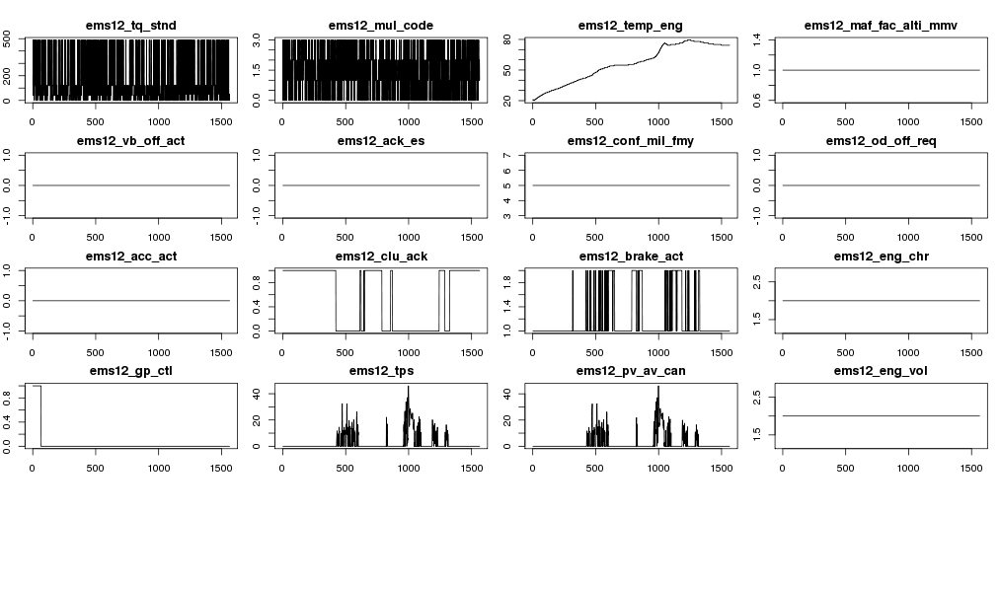

---
output:
html_document:
toc: yes
---
---
title: "Hongple"
author: "Joel Lee"
since: "2015. 6. 4."
output: html_document
runtime: shiny
---


#### 가설

```
초당 센서 값들의 각 조합에 대한 발생빈도를 계산, 발생 확률이 극히 낮거나 처음 발견되는 센서 값의 조합 발생시 이상패턴으로 정의, 탐지 가능하다.
```

#### 대상 데이터 

- 단말사양 : AVN4 RC
- 국가 : 국내
- 차종 : UM
- 종류 : 주기적 운행 로그 (월 1회, vin별 1 trip, 1시간 이내 sample rate : 1 sec.)
- 테이블 : hkmc_tms.drv_rg_log_ps_avn4_rc
- 센서 : 227개
- 기간 : 약 8개월(2014.10 ~ 2015.6)
- 클러스터 : 분석계 대화형
- 데이터베이스 : vcrm_6442267

#### 주기적 운행로그 수집주기 변경 vin 리스트
- 대상 : UM 400대 (2.0, 2.2 각 200대), AG 100대
- 변경 주기 : 월 1회  일 1회
- 기간 : 15년 1월 15일 ~ 3월 4일

#### 분석 프로세스

```
연속형센서 범주화 및 기초 통계 -> 이상 패턴 탐색 -> RO/DTC 연계 분석
```

##### 초기화 및 대화형 임팔라 접속  
```{r load, echo=FALSE, results='hide'}

# install.packages("Hmisc")
# install.packages("RODBC")
# install.packages("sqldf")
# install.packages('ggplot2')
# install.packages("psych")
# install.packages("rmarkdown")
# install.packages("cluster")
# install.packages("fpc")

library("Hmisc")
library("rmarkdown")
library("RODBC")
library("sqldf")
library(ggplot2)
library("psych")
library(cluster)
library(fpc)
```

```{r echo=FALSE}
setwd("~/workspace/hongple")
rm(list = ls())  # clear objects  
conn = odbcConnect( "Impala2" )
sqlQuery( conn, "invalidate metadata" )
```

##### 1차 데이터 가공
- drv_rg_log_ps_avn4_rc_seq : 정기 운행로그에 주행별 시퀀스 추가(61,972,965건)

차종  | 레코드수(초당)
---- | ----
DM  | 19110538
UM  | 36321553
KH  | 106191
AG  | 6432762
TL  | 1921

차종 | 주행 횟수 | 최초 주행시간 | 최종 주행시간 | 평균 주행(초수)
------------ | ---------- | ------------ | ------------- | ---------
DM  | 12410 | 20141102020436  | 20150405185031  | 1534
UM  | 24863 | 20141001055302  | 20150405175643  | 1446
KH  | 78  | 20150111002956  | 20150405095542  | 1361
AG  | 4655  | 20141111093204  | 20150405104945  | 1379
TL  | 1 | 20150404181150  | 20150404181150  | 1921

차종 |	차량대수 
--- | ---
UM	| 4904
AG	| 703
DM	| 5578
TL	| 1
KH	| 49

샘플 데이터 가져오기
```{r qplot, fig.height=3, fig.width=6, cache=TRUE}
df_sample = data.frame(sqlQuery( conn, "select * from vcrm_6442267.drv_rg_log_ps_avn4_rc_seq
                                 where vin = 'KNAPK81ABFA010727' and ignitiontime = '20141211074429'
                                 order by seq_num"))

#plot(df$seq_num, df$ems16_tqi_min, type="l", ylab="ems16_tqi_min", xlab="time(sec)")
qplot(seq_num, ems11_tqi, data = df_sample) + geom_smooth()
```

연속형 멀티센서 시계열 탐색
```{r plot}
# timeseries multiple plot
# par(pch=22, col="red") # plotting symbol and color 
graphics.off()    # close graphics windows
# 20 of 227 plots on one page
par(mfrow=c(5, 4), mar = c(2, 2, 2, 1), oma = c(0, 0, 1, 0)) 
signals = names(df_sample)

for(i in 7:25){ 
    signal_ts <- df_sample[,i]
    plot.ts(signal_ts, type="l", main=signals[i]) 
    }
```


##### 2차 데이터 가공  
- drv_rg_log_ps_avn4_rc_factor5 : 연속형 센서 범주화

```{r}

df_sample = data.frame(sqlQuery( conn, "select * from hkmc_tms.drv_rg_log_ps_avn4_rc
                                 where vin = 'KNAPK81BBFA006424' order by t"))
summary(df_sample)
describe(df_sample)
```

- 전체 센서들에 대한 조합의 빈도수가 높지 않아 불필요한 센서 제거해야함.
- engfrzfrm12 센서그룹 제외(NULL 만 들어있음)
- 주요 센서그룹 Null 비율

센서그룹 | 전체 NULL(건수) | 전체 NULL(비율) | UM NULL(건수) | UM NULL(비율)
---- | ---- | ---- | ---- | ----
engfrzfrm12 | 61,972,965 | `r 61972965/61972965*100`% | 36,321,553 | 100%
ems19 | 25,649,491 | `r 25649491/61972965*100`% | 0 | 0%
fatc11 | 25,650,803 | `r 25650803/61972965*100`% | 1,312 | `r 1312/36321553*100`%
bat11 | 25,650,996 | `r 25650996/61972965*100`% | 1,505 | `r 1505/36321553*100`%
cgw1 |  26,613,289 | `r 26613289/61972965*100`%  | 963,797 | `r 963797/36321553*100`%


Checksum 센서 제외  
- ems19_cf_ems_checksumems9
- ems16_checksum
- fatc11_cf_fatc_chksum
- tcu11_cf_tcu_chksum1
- sas11_checksum
- tcu12_cf_tcu_chksum
- tcu13_cf_tcu_chksum3 


##### 3차 데이터 가공
UM(Disel) 차종의 센서그룹별 센서조합의 통계를 구해서 센서별 특징을 파악한다.  


#### 주요 영향요인(센서) 분석  

```{r results="asis", cache=TRUE, echo=FALSE}
library(xtable)
print_desc <- function(df){
    xt <- xtable(describe(df))
    print(xt, type="html")
}

sensors = data.frame(sqlQuery( conn, "select * from vcrm_6442267.factor5_um2_vin"))
print_desc(sensors)

ggplot(data=sensors, aes(x=id, y=cnt)) + geom_bar(colour="black", stat="identity")
#ggplot(data = sensors) + geom_density(aes(x=cnt), fill = "grey50") 
#+ scale_y_continuous(limits = c(0.000001))
```

**주성분 분석(PCA)**
```{r pca, fig.height=8, fig.width=8}

#graphics.off() 
#layout(matrix(c(1,2,3,4),2,2)) # optional 4 graphs/page 
# 표준편차 0이 아닌 센서만 선별
test_df <- sensors[sensors$cnt<=30,c(2:15)]
#test_df <- sensors[,c(1,4,6,8,9,10,11,12)]
pca = prcomp(test_df, scale=TRUE)
#round(predict(pca),2)
#png("sensors_pca.png")
#plot(pca, type="lines")
biplot(pca)
#dev.off()
```

**요인 분석(Factor Analysis)**
```{r}
fa.parallel(test_df)
fit <- factanal(test_df, 3, rotation="promax")
fit
```

```{r factor, fig.height=4, fig.width=6}
load <- fit$loadings[,1:2] 
plot(load,type="n") # set up plot 
text(load,labels=names(test_df),cex=.7)
```

**회귀 분석**
```{r}
lm_df <- sensors[sensors$cnt<=30,]
g = lm(pct ~ vin+ems11_n+ems11_vs+ems12_pv_av_can+ems11_tqi_acor+ems14_vb+ems_h12_cf_ems_isgstat+tcu11_n_tc+tcu11_swi_cc+tcu12_cur_gr+ems12_temp_eng+ems16_eng_stat+tcu11_temp_at+tcu11_tqi_tcu+ems11_swi_igk, data = lm_df)
summary(g)
coefficients(g)
#anova(g)
# diagnostic plots 
#graphics.off() 
#layout(matrix(c(1,2,3,4),2,2)) # optional 4 graphs/page 
#plot(g)
```

**군집 분석**
```{r}
# k-means
cl_result <- kmeans(test_df, iter.max = 1000, centers = 3)
# DBSCAN
cl_result <- dbscan(test_df, eps=2, MinPts=5)
#plotcluster(test_df, km_result$cluster)
clusplot(test_df, cl_result$cluster, color=TRUE, shade=TRUE, labels=2, lines=0)

# hierachical 
source("myfunctions.R")
d <- dist(test_df, method = "euclidean") # distance matrix
hc <- hclust(d, method="ward.D")
plot(hc) # display dendogram
groups <- cutree(hc, k=4) # cut tree into 5 clusters
# draw dendogram with red borders around the 5 clusters 
rect.hclust(hc, k=4, border="red")
```

**상관 분석**
```{r}
# First Correlogram Example
library(corrgram)
corrgram(test_df, order=TRUE, lower.panel=panel.shade, upper.panel=panel.pie, text.panel=panel.txt,
  main="EMS12 Data Correlation")
```

```{r results="asis", echo=FALSE}
# conn = odbcConnect( "Impala2" )
# sqlQuery( conn, "invalidate metadata" )
library(xtable)

print_summary <- function(df){
    df$ro_y <- sapply(df$ro_y, as.factor)
    df$ceq_rgst_dt <- sapply(df$ceq_rgst_dt, as.factor)

    xt <- xtable(summary(df))
    print(xt, type="html")
}
```

**주요센서 + RO**  
```{r results="asis"}
sensor_vin_ro = data.frame(sqlQuery( conn, "select * from vcrm_6442267.factor5_um_vin_ro_ads"))
print_summary(sensor_vin_ro)

g = lm(ro_cnt ~ vin + id, data = sensor_vin_ro)
summary(g)
coefficients(g)
#anova(g)
# diagnostic plots 
#graphics.off() 
#layout(matrix(c(1,2,3,4),2,2)) # optional 4 graphs/page 
#plot(g)


```


